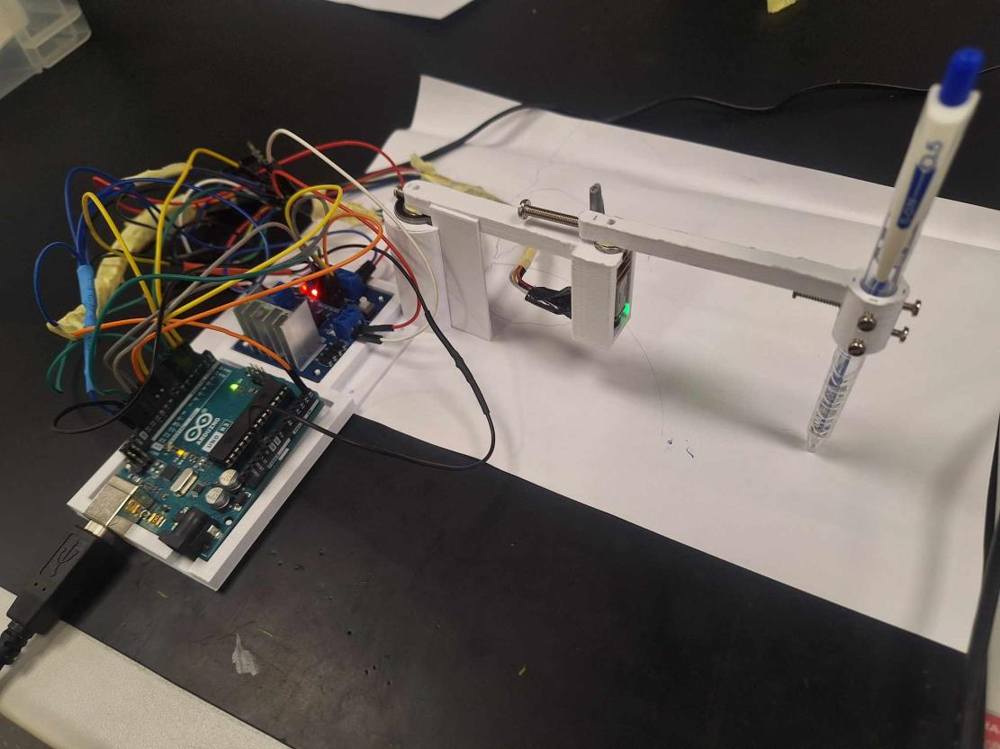

# Applied Medical Robotics Project

This is my project for the 'Applied Medical Robotics' module of my MSc at King's College London. The course offers us a wide range of skills including CAD, electronic assembly, microcontroller programming, serial communication, and robotic theory. I create this repository long after the project finished. The codes are **BADLY DESIGNED** and **COMMENTED** as they are one of my first programming projects.

# Aim and Objectives:

Building a 2 degree-of-freedom robot for drawing.

# Method:

The project included the following components:

- CAD design a 2 degree-of-freedom robot for drawing and assemble thems with motors and microcontroller.

- Programming a PID control in the Arduino and a task space controller in MATLAB.

- Communicating between them through a serial communication.

- Adding some other addtionally features for more points.

# Result:

I got a total of 8.9/10.

# Note:

The CAD design was done on [Onshape](https://cad.onshape.com/documents/e2da70dce3c13f96e1930bb0/w/108b6edd65af48e6c71ceee4/e/1b72564fc3dfb2513c34a11c)

The [Arduino/microcontroller/microcontroller.ino](Arduino/microcontroller/microcontroller.ino) contains the C++ code to upload to the Arduino board.

The [MATLAB](MATLAB) contains the MATLAB codes, with [setup.m](MATLAB/setup.m) being the main script, and others are support functions. I don't recall how the MATLAB files are structured, which is why they are a mess there.
